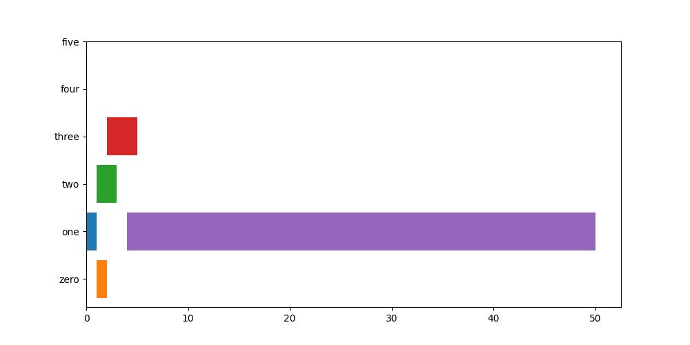

# 简单算法可视化——将图片拼接为视频

算法可视化是展示算法效果，熟悉算法原理的重要手段。一般来说，静态图片能够完成我们想要的效果，但是如果希望将算法的演进过程展示出来，一般还需要将算法的中间过程的快照，形成连续播放的视频。本文主要是用一段简单的python脚本，完成图片拼接为视频的过程。

## 工具
python
pip install opencv-python
pip install matplotlib

## 代码
### 生成图片
这里用了一组简单的甘特图，让其中的一个甘特条的尾部，逐渐增长，作为需要展示的动态效果的例子。
```python
import os
import matplotlib.pyplot as plt


class GanttBar:
    def __init__(self, x_start: float = 0, x_end: float = 1, y: int = 0):
        self.x_start = x_start
        self.x_end = x_end
        self.y = y


def make_gantt_chart_files(dir_images: str = "./image_gantt"):
    if not os.path.exists(dir_images):
        os.makedirs(dir_images)
    n_chart: int = 16
    for i_chart in range(n_chart):
        bars: [GanttBar] = [
            GanttBar(0, 1, 1),
            GanttBar(1, 2, 0),
            GanttBar(1, 3, 2),
            GanttBar(2, 5 + i_chart, 3),
            GanttBar(4, 50, 1)
        ]
        plt.figure(figsize=(10, 5))
        for bar in bars:
            plt.barh(bar.y, bar.x_end - bar.x_start, left=bar.x_start)
        plt.yticks(ticks=range(0, 6), labels=["zero", "one", "two", "three", "four", "five"])
        file_name = os.path.join(dir_images, str(i_chart) + '.jpg')
        plt.savefig(file_name)
        print("save fig: {}".format(file_name))
```
从生成的图片中挑选了首位两张



### 将图片转为视频

```PYTHON
import os
import cv2

def gantt_charts_to_video(dir_images="./image_gantt", dir_video="./videos", file_video="gantt"):
    # get image file names
    file_names = os.listdir(dir_images)
    file_names = [o for o in file_names if o.split('.')[-1] == 'jpg']
    if not file_names:
        print("warning: no file.")
        return
    file_names = sorted(file_names, key=lambda x: int(x.split('.')[-2]))
    print("file names: ", file_names)

    # get parameter for cv and initialize cv instance
    video_dir = os.path.join(dir_video, file_video + '.avi')
    if not os.path.exists(dir_video):
        os.makedirs(dir_video)
    fourcc = cv2.VideoWriter_fourcc(*'MJPG')
    fps = 4
    shape = cv2.imread(os.path.join(dir_images, file_names[0])).shape
    image_size = (shape[1], shape[0])
    video_writer = cv2.VideoWriter(video_dir, fourcc, fps, image_size)

    # read images and create video file
    for file_name in file_names:
        full_path = os.path.join(dir_images, file_name)
        image = cv2.imread(full_path)
        video_writer.write(image)
    video_writer.release()
```
其中需要注意fps的设置，也就是帧率的设置。这里设置为4，表示一秒钟播放4张图片。

执行上述函数

```python
if __name__ == '__main__':
    make_gantt_chart_files()
    gantt_charts_to_video()
```
生成视频`./videos/gantt.avi`，参考附件压缩包中的文件。

## 参考
https://blog.csdn.net/chenfang0529/article/details/118633899
https://blog.csdn.net/weixin_45564943/article/details/121757164
https://www.jianshu.com/p/5f7b69a87809
https://www.jb51.net/article/223931.htm
https://www.jianshu.com/p/64c34e21a5e1
